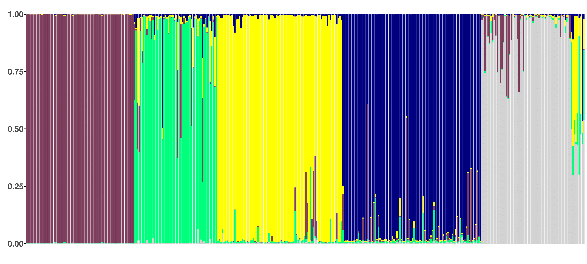

# R Functions for plotting STRUCTURE files

## manully set cluster color

   - scale_fill_manual(values=c("Cluster1"="navy", "Cluster2"="yellow", "Cluster3"="#7F405F", "Cluster4"="springgreen", "Cluster5"="lightgray"))

## revision

   - theme(axis.line=element_blank(),axis.ticks=element_blank(),axis.text.x=element_blank(),axis.text.y=element_text(size=20, face="bold"),legend.position="none") 

   - theme(axis.ticks.y=element_line(size=1,color = "black")) 

   - labs(x="",y="")

## Dependencies

   - R 3.3.1
   - library: reshape, ggplot2, stringr

## Dataset

   - STRUCTURE output

## Result

   

## How To Use
   
   As introduced in "Genetic-Structure-Tools".
   - source("plotSTR.r")
   - plotSTR("filename.csv")

## References

  - Genetic-Structure-Tools
    https://github.com/DrewWham/Genetic-Structure-Tools